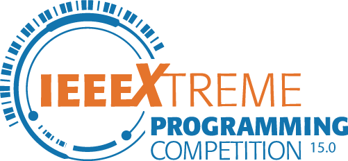
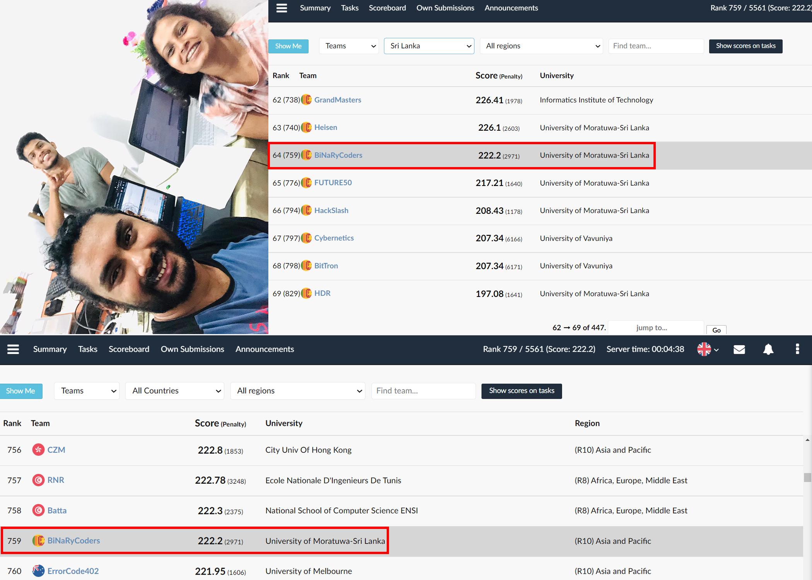

# IEEEXtreme 15.0 (23.10.2021)

> IEEEXtreme is a global challenge in which teams of IEEE Student members – advised and proctored by an IEEE member, and often supported by an IEEE Student Branch – compete in a 24-hour time span against each other to solve a set of programming problems.

Visit https://ieeextreme.org for more information!😁  

This repository contains implementations for some questions that we try at the competition. Only few of them work!

---

# Team BiNaRyCoders: World Rank 759; Country Rank 64

